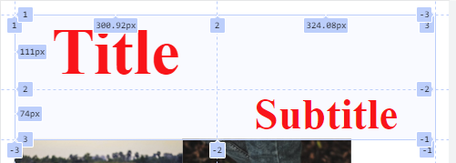
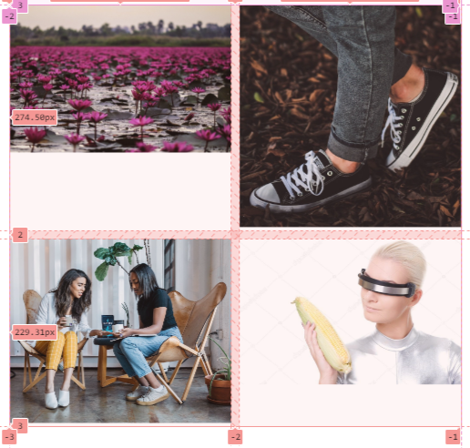
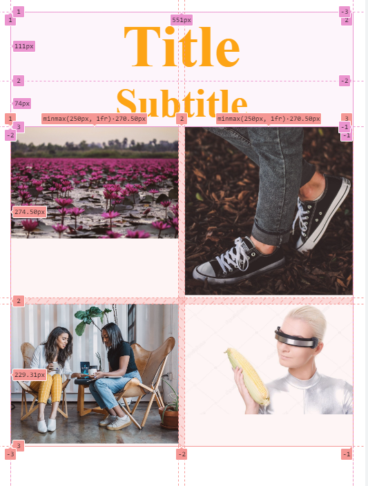

# Media Queries and RAM for Galleries

[Website with Clear Examples of CSS Responsive](https://www.bitdegree.org/learn/responsive-media)

## Steps for the Desktop-Sized Webpage

1. Layout the Title and Subtitle using **Grid-Areas** and some justification.

2. Layout the Gallery Using Grid RAM with a min size of 250px. Include a gap of 10px.

## Steps for the Mobile-Sized Webpages

Add two media queries to this simple website.

[Instructional Video from Net Ninja](https://www.youtube.com/watch?v=Xig7NsIE6DI)

[Shorter Video from Web Dev Simplified](https://youtu.be/yU7jJ3NbPdA?si=n-gvX0h7NXsH3JpU)

1. At max-width of 1000px:

   - Set body text color to blue.

2. At max-width of 600px:

   - Set Title and Subtitle Layout to be in one column.
   - Set body text color to orange.

